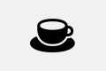
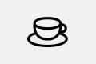

# Caffeinate
A macOS menubar app to temporarily prevent the Mac from sleeping.

## How does it work
Left-clicking the cup toggles Caffeinate. If the cup is filled, your Mac won't go to sleep anymore.
Right-clicking the cup opens a menu where you can choose which kinds of sleep to prevent, toggle **Start at login**, and quit the app.

### Keep awake options
These mirror the flags of the built-in `caffeinate(8)` command-line tool and can be toggled independently. The defaults match `caffeinate -dims`:

| Menu item | `caffeinate` flag |
|-----------|-------------------|
| Prevent display sleep | `-d` |
| Prevent system idle sleep | `-i` |
| Prevent disk idle sleep | `-m` |
| Prevent system sleep (on AC power) | `-s` |

 dark mode Caffeinate active
 dark mode Caffeinate inactive

 light mode Caffeinate active
 light mode Caffeinate inactive

## Requirements
The app requires macOS 11 or later to run. If you are using macOS 13, you can add the app to the login items via the app settings.

## Installation
You can compile the app yourself with Xcode (`xcodebuild -configuration Release`), build a bundle without full Xcode using `./scripts/make-app.sh` (Command Line Tools only), or download a compiled version from [releases](https://github.com/MichaelCWarren/Caffeinate/releases).

## FAQ
**How do I quit?**

Right-click the menu bar item and choose **Quit Caffeinate**.

## TODO
Even if the lid is closed, prevent the Mac from sleeping. This probably requires root privelages.

## Links
[CPUMonitor menu bar app](https://github.com/Lennard599/CPUMonitor)

[ClipBoardManager menu bar app](https://github.com/Lennard599/ClipBoardManager)