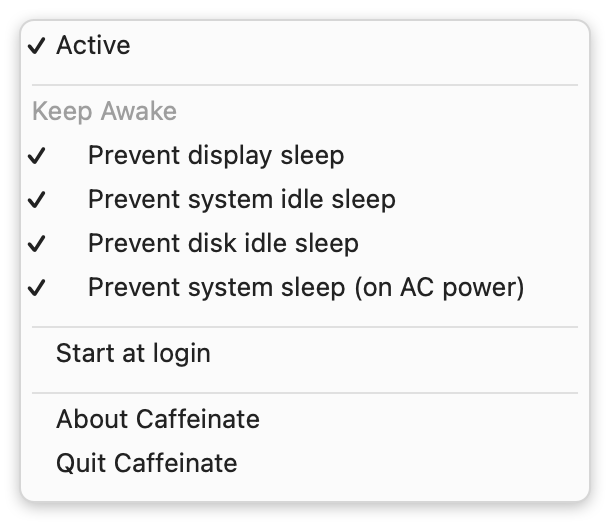

# Caffeinate
A macOS menubar app to temporarily prevent the Mac from sleeping.

## How does it work
Left-clicking the cup toggles Caffeinate. If the cup is filled, your Mac won't go to sleep anymore.
Right-clicking the cup opens a menu where you can choose which kinds of sleep to prevent, toggle **Start at login**, and quit the app.



### Keep awake options
These mirror the flags of the built-in `caffeinate(8)` command-line tool and can be toggled independently. The defaults match `caffeinate -dims`:

| Menu item | `caffeinate` flag |
|-----------|-------------------|
| Prevent display sleep | `-d` |
| Prevent system idle sleep | `-i` |
| Prevent disk idle sleep | `-m` |
| Prevent system sleep (on AC power) | `-s` |

### Auto-off timer
Optionally have Caffeinate turn itself off after a set time. Under **Auto-off after…** in the right-click menu, pick a preset (15 minutes up to 8 hours) or **Custom…** to enter your own duration in minutes; choose **Off** to disable it. When enabled, activating Caffeinate starts a countdown that appears next to the cup in the menu bar (and in the **Active** row of the menu), and Caffeinate deactivates automatically when it reaches zero.

 dark mode Caffeinate active
 dark mode Caffeinate inactive

 light mode Caffeinate active
 light mode Caffeinate inactive


## Requirements
The app requires macOS 11 or later to run. The **Start at login** option (in the right-click menu) requires macOS 13 or later.

## Installation

### Download a release
Download `Caffeinate.app.zip` from [releases](https://github.com/MichaelCWarren/Caffeinate/releases), unzip it, and move `Caffeinate.app` to `/Applications` (or `~/Applications`).

The released build is ad-hoc signed (no Developer ID / notarization), so on first launch you may need to right-click the app → **Open**. If Gatekeeper blocks it, clear the quarantine flag:

```sh
xattr -dr com.apple.quarantine /Applications/Caffeinate.app
```

### Install with chezmoi
Add an entry to your `.chezmoiexternal.toml` to pull the app straight from the release. This installs to `~/Applications`, which Finder treats as a real Applications folder:

```toml
["Applications/Caffeinate.app"]
    type = "archive"
    url = "https://github.com/MichaelCWarren/Caffeinate/releases/download/v1.1.0/Caffeinate.app.zip"
    stripComponents = 1
    exact = true
    refreshPeriod = "168h"
```

`stripComponents = 1` drops the leading `Caffeinate.app/` in the archive so its `Contents/` lands directly in the target directory. chezmoi's downloader does not set `com.apple.quarantine`, so the ad-hoc-signed app launches without the Gatekeeper prompt. Bump the `url` tag whenever you cut a new release.

### Build it yourself
- **With Xcode:** `xcodebuild -configuration Release`
- **Without full Xcode** (Command Line Tools only): `./scripts/make-app.sh` compiles the sources with `swiftc`, builds `AppIcon.icns` from the asset catalog, and assembles `Caffeinate.app` in the repo root.

## Building and releasing
The icon PNGs are committed under `Caffeinate/Assets.xcassets/AppIcon.appiconset/`. To regenerate them from the `cup.and.saucer` SF Symbol, run `swift scripts/make-icon.swift Caffeinate/Assets.xcassets/AppIcon.appiconset`. The README images (`Images/`) are likewise generated by `swift scripts/make-screenshots.swift Images`.

To cut a release (matching the `Caffeinate.app.zip` asset the upstream repo ships):

1. Bump the version in `scripts/make-app.sh` (`CFBundleShortVersionString`) and `Caffeinate.xcodeproj/project.pbxproj` (`MARKETING_VERSION`).
2. Build the release archive:

   ```sh
   ./scripts/release.sh   # builds Caffeinate.app and Caffeinate.app.zip
   ```

3. Publish it, then update the tag referenced by chezmoi:

   ```sh
   gh release create vX.Y.Z Caffeinate.app.zip --title "Version X.Y.Z" --notes "..."
   ```

`scripts/release.sh` packages the bundle with `zip -X -y` so the archive extracts cleanly with any unzipper (including chezmoi's), without stray AppleDouble `._*` files, while preserving the ad-hoc code signature.

## FAQ
**How do I quit?**

Right-click the menu bar item and choose **Quit Caffeinate**.

## TODO
Even if the lid is closed, prevent the Mac from sleeping. This probably requires root privelages.

## Links
[CPUMonitor menu bar app](https://github.com/Lennard599/CPUMonitor)

[ClipBoardManager menu bar app](https://github.com/Lennard599/ClipBoardManager)